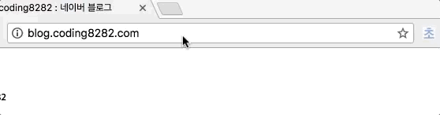
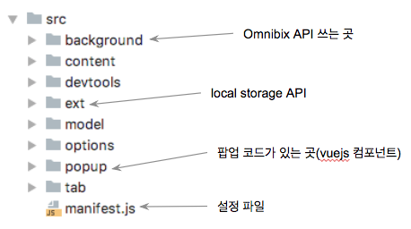

# 개요

"https://naver..." 아직도 주소를 타이핑하시나요? 이제 한손으로 초성만 입력하세요! "ㄴㅇㅂ" 이렇게 초성만 입력하시면 바로 이동합니다~ 
**한국어를 사용하는 분이라면 누구나 초성검색의 이점**을 누릴 수 있습니다. 예를 들어 주소창에 "https://github.com"을 입력하는 대신 "ㄱㅎㅂ"를
입력하면 타이핑도 절감되고 왼손으로만 검색이 가능합니다!

# 구현
이 툴은 브라우저 Chrome의 확장프로그램으로서 제공합니다. Chrome의 Omnibox API를 이용하고, 기타 설정 화면은 vuejs를 사용해 구현하였습니다.
다만, 생산성을 위하여 [vue-chrome-extension-template](https://github.com/YuraDev/vue-chrome-extension-template)과
[Webpack Chrome Extension Reloader](https://github.com/YuraDev/wcer)을 통합하여 개발 환경을 구축합니다. 

이 프로그램의 주요 기능은 80% 이상을 Omnibox API가 제공하고 있고, 나머지 관리 기능은 popup에서 제공하는 간단한 프로그램입니다.
브라우저 주소창에 미리보기 목록을 "Sugestion"이라 부르는데요, 이 프로그램에서는 Sugestion에 관련된 정보를 Constraction(축약어라는 뜻)이라는 개념으로 
모델링합니다. 궁극적으로 **사용자는 Constraction이라는 모델을 관리하는 주체로서 storage에 저장(영속화)하거나, 주소창에 Sugestion이라는 형태(presentation)**로
이용하게 됩니다.

